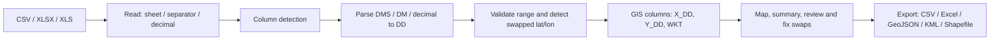
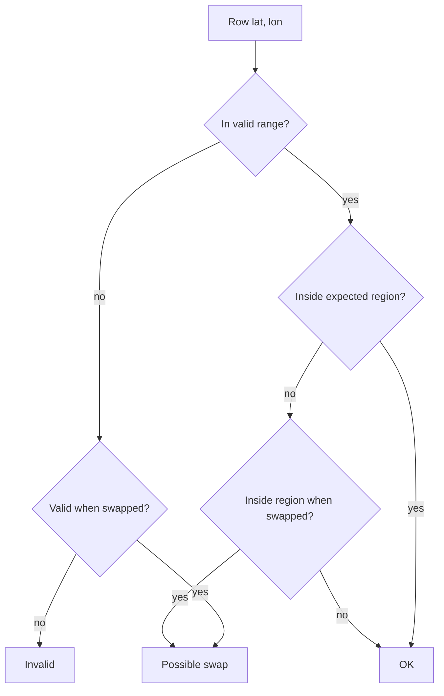

# GeoCoord - DMS to Decimal Degrees Coordinate Converter

[](https://www.apache.org/licenses/LICENSE-2.0)
[](https://www.python.org)
[](https://streamlit.io)
[](https://github.com/PedroMMGoncalves/geocoord/actions/workflows/ci.yml)
[](https://doi.org/10.5281/zenodo.20596871)

*Convert field coordinates from degrees-minutes-seconds to decimal degrees,
ready for QGIS and ArcGIS.*

GeoCoord converts geographic coordinates from degrees-minutes-seconds (DMS) to
decimal degrees (DD). It reads tabular data (CSV/Excel), validates and converts
latitude/longitude columns, and produces GIS-ready outputs for QGIS and ArcGIS
in the WGS84 / EPSG:4326 reference system.

The tool runs as a [Streamlit](https://streamlit.io/) web application and can be
packaged as a standalone Windows desktop application, with no Python
installation required on the target machine, through
[stlite](https://github.com/whitphx/stlite).

## Workflow



## Features

- Reads CSV, XLSX, and XLS, tolerant of messy spreadsheet exports (a blank
  header line, a leading empty column, decimal commas), with automatic column
  detection (including `X`/`Y`), Excel sheet selection, and a configurable CSV
  separator/decimal.
- Live preview of the conversion before it is applied to the whole table.
- Conversion of multiple input formats (see below), with hemisphere detection
  in Portuguese and English (prefix or suffix) and explicit negative-sign
  handling.
- Range validation and detection of likely swapped latitude/longitude, with a
  review step before any correction is applied. Valid points that fall outside
  the declared region are flagged, naming the region they actually fall in.
- Colour-blind-safe map (valid vs possible swap, with a legend) and a points
  summary (bounding box, centroid).
- GIS-ready columns (`X_DD`, `Y_DD`, `WKT`), optional DMS columns (DD -> DMS),
  and a single-coordinate converter.
- Export to CSV, Excel, GeoJSON, KML, and Shapefile (zipped), all WGS84 /
  EPSG:4326, selectable with checkboxes; output files are named after the input
  file, sanitised for GIS.
- Guided, step-by-step interface with results organised into Table, Map,
  Summary and Download tabs.

## Input formats

| Format | Example | Result |
| --- | --- | --- |
| Decimal degrees | `38.7`, `-9,5` | `38.700000`, `-9.500000` |
| Degrees + decimal minutes | `38° 42.5'` | `38.708333` |
| Degrees-minutes-seconds | `38° 42' 30" N` | `38.708333` |

Hemispheres: `N`/`E`/`L` are positive; `S`/`W`/`O` are negative (`O` = Oeste,
`L` = Leste). A leading `-` is honoured when no hemisphere letter is present.

## Example

Input file (`sites.csv`):

| name | lat | lon |
| --- | --- | --- |
| Lisboa | 38° 42' 30" N | 9° 8' 12" W |
| Porto | 41° 9' 44" N | 8° 36' 39" W |

After conversion, GeoCoord appends:

| name | Latitude_DD | Longitude_DD | X_DD | Y_DD | WKT | status |
| --- | --- | --- | --- | --- | --- | --- |
| Lisboa | 38.708333 | -9.136667 | -9.136667 | 38.708333 | POINT (-9.136667 38.708333) | OK |
| Porto | 41.162222 | -8.610833 | -8.610833 | 41.162222 | POINT (-8.610833 41.162222) | OK |

Note the negative longitudes: western (`W`/`O`) coordinates are converted with
the correct sign.

## Requirements

- Python 3.9+
- Dependencies listed in [`requirements.txt`](requirements.txt): `streamlit`,
  `pandas`, `openpyxl`, `xlrd`, `pyshp`.

## Installation

```bash
python -m pip install -r requirements.txt
```

## Usage

### Web application

```bash
python -m streamlit run app.py
```

On Windows, `scripts\run_app.bat` installs the dependencies and starts the application.
The interface opens at `http://localhost:8501`. The application can also be
deployed for free on
[Streamlit Community Cloud](https://streamlit.io/cloud) directly from this
repository.

### Single coordinate

The "Quick conversion" tab converts a single latitude/longitude pair without
loading a file.

## Output convention

For geographic coordinates in WGS84 / EPSG:4326:

| GIS axis | Generated column | Meaning |
| --- | --- | --- |
| X | `X_DD` | Longitude |
| Y | `Y_DD` | Latitude |

A `WKT` column (`POINT (longitude latitude)`) and a per-row `status` column are
also produced. For continental Portugal, latitude is roughly 37-42
and longitude roughly -9 to -6 (West). Western longitudes must carry `O`/`W` or
a negative sign in the source data, otherwise their sign cannot be inferred.

## Detecting swapped coordinates

A common error is having latitude and longitude swapped in some rows. GeoCoord
flags these and lets you anchor detection to where the data should be:

- **Region mask (recommended):** pick the region your data belongs to —
  Portugal mainland (the default), Azores, Madeira, Angola, Cabo Verde,
  Guiné-Bissau, Moçambique, São Tomé e Príncipe — or a custom centre. A row
  that falls outside the region but lands inside it when its coordinates are
  swapped is flagged. This is reliable regardless of how the data clusters.
- **Range:** a value that cannot be a latitude (|lat| > 90) but becomes valid
  when swapped is reported as a likely swap.
- **Auto cluster:** with no region set, the densest cluster of points is taken
  as the expected location. Convenient, but from coordinates alone the correct
  orientation is ambiguous when about half the data is swapped (the densest
  cluster may be the swapped one); an "invert" option handles that case.



When you declare a region, valid points that are neither inside it nor
recoverable by swapping are kept but flagged as **outside the selected
region**, naming the region they actually fall in, with a one-click switch.
This surfaces a region chosen by mistake or coordinates that point elsewhere,
instead of silently reporting them as OK.

Suggestions are always shown for review and never applied automatically.

## Desktop application (stlite + Electron)

Builds a Windows installer that runs without a Python installation (Python runs
in WebAssembly via Pyodide, bundled inside Electron).

Requirements: [Node.js](https://nodejs.org/) 18+.

```bash
npm install        # @stlite/desktop, electron, electron-builder
npm run dump       # download Pyodide + wheels and generate artifacts
npm run serve      # optional: preview in an Electron window
npm run app:dist   # build the installer into dist/
```

On Windows, `scripts\build_exe.bat` runs these steps. Place `assets/icon.ico`
for a custom icon. Only pure-Python packages are supported in this mode; `.xls`
support is best-effort. The map basemap requires internet access; points are
plotted even offline.

## Tests

```bash
python -m pytest
```

The conversion engine is isolated in
[`geocoord/converter.py`](geocoord/converter.py) and covered by the suite in
[`tests/`](tests/). Continuous integration runs the suite across
Python 3.11, 3.12, and 3.13.

## Web application (browser)

A JavaScript port of the conversion engine lives in `web/`, for the browser
application published on GitHub Pages. It is a deliberate translation of
`geocoord/converter.py`, not a rewrite: both implementations are checked against
the same contract in `tests/fixtures/parity.json`, so a divergence on any pinned
case fails both test suites. Behaviour the contract does not pin is not
protected, which is why widening it means adding cases rather than only
regenerating.

```bash
cd web
npm install
npm test
npm run dev      # dev server with hot reload, at http://localhost:5173
npm run build    # production bundle, written to web/dist/
```

Regenerate the contract only when the shared behaviour is meant to change:

```bash
python scripts/gen_parity_fixtures.py
```

Review the diff by eye before committing it — the file is the reference both
sides are held to, and `python scripts/gen_parity_fixtures.py --check`, which
the CI runs, fails if the committed file and the generator disagree.

## Project structure

```text
app.py                 Streamlit interface
geocoord/              Conversion library (importable package)
  __init__.py          Package initialiser
  converter.py         Conversion + swap-detection engine (pure logic, testable)
  geoexport.py         GeoJSON / KML / Shapefile writers (pure Python)
tests/                 Test suite (pytest)
  fixtures/parity.json Shared contract, generated then frozen — do not hand-edit
web/                   JavaScript port of the engine (browser app)
scripts/               Helper scripts
  run_app.bat          Run the web application
  build_exe.bat        Build the desktop installer
  gen_parity_fixtures.py Regenerate the Python/JavaScript parity contract
requirements.txt       Python dependencies
pytest.ini             pytest configuration
.streamlit/            Application theme
package.json           stlite/Electron configuration
assets/                Installer resources (icon)
.github/workflows/     Continuous integration
```

## Troubleshooting

- **Messy spreadsheet exports load fine.** A blank first line, a leading empty
  index column, fully empty rows, and decimal commas inside quoted fields
  (`"33,6603"`) are handled automatically: the real header is recovered and the
  values are parsed. Coordinate columns named `X`/`Y` (GIS convention: `Y` =
  latitude, `X` = longitude) are also auto-detected.
- **Western longitudes have the wrong sign.** The source values must include a
  hemisphere letter (`W`/`O`) or a leading `-`. Without it, the sign cannot be
  inferred and the value is treated as positive (East).
- **Some rows are not converted.** Open the "rows with issues" panel; the
  `status` column reports whether a value could not be parsed or fell outside
  the valid range.
- **The map is blank.** The basemap tiles need an internet connection; the
  points themselves are still plotted offline.
- **`.xls` files fail in the desktop build.** The stlite/Pyodide runtime only
  bundles pure-Python wheels; convert legacy `.xls` to `.xlsx` or CSV, or use
  the web application for `.xls`.

## Citation

If you use this software, please cite it using the metadata in
[`CITATION.cff`](CITATION.cff):

> Gonçalves, P. (2026). *GeoCoord - DMS to Decimal Degrees Coordinate
> Converter* (Version 0.1.0) [Computer software]. LNEG - Laboratório Nacional
> de Energia e Geologia. <https://doi.org/10.5281/zenodo.20596871>

## License

Licensed under the Apache License, Version 2.0. You may use, modify, and
redistribute this work, commercially or otherwise, provided attribution is
preserved; an explicit patent grant and patent-retaliation clauses apply per
the Apache 2.0 terms. See [LICENSE](LICENSE).

## Acknowledgements

Developed by Pedro Gonçalves at LNEG - Laboratório Nacional de Energia e
Geologia.

## References

- World Geodetic System 1984 (WGS84), EPSG:4326.
- H. Butler, M. Daly, A. Doyle, S. Gillies, S. Hagen, T. Schaub (2016).
  *The GeoJSON Format* (RFC 7946). IETF.
- OGC Simple Feature Access - Well-Known Text (WKT) geometry representation.
