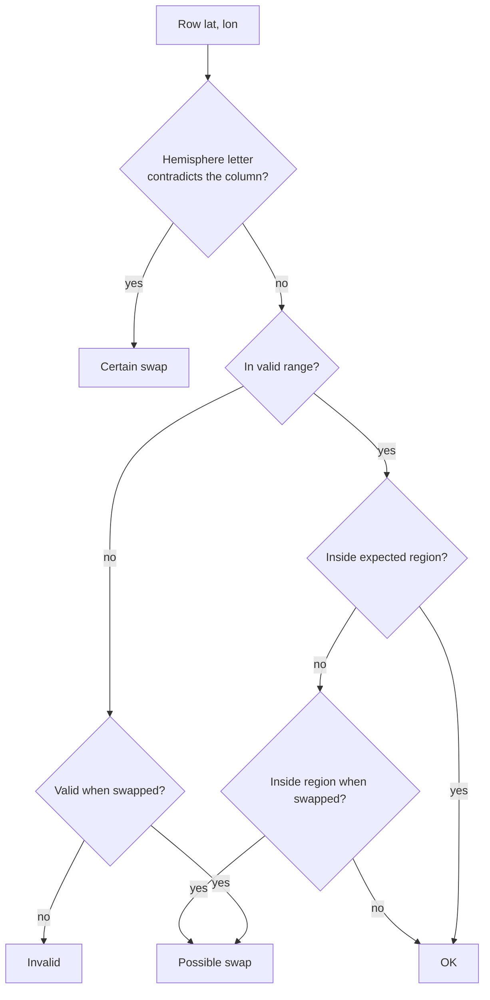

# GeoCoord

> Browser-based coordinate converter for field data: degrees-minutes-seconds to decimal degrees, CSV and Excel in, detection of latitude/longitude swapped between columns, transformation between coordinate reference systems, and export to CSV, Excel, GeoJSON, KML, Shapefile and GPX.

[](https://react.dev)
[](https://vitejs.dev)
[](https://leafletjs.com)
[](http://proj4js.org)
[](https://www.python.org)
[](https://streamlit.io)
[](#coordinate-systems)
[](#usage)
[](LICENSE)
[](https://github.com/PedroMMGoncalves/geocoord/releases)
[](https://doi.org/10.5281/zenodo.20596871)
[](https://github.com/PedroMMGoncalves/geocoord/actions/workflows/ci.yml)
[](https://github.com/PedroMMGoncalves/geocoord/actions/workflows/deploy.yml)
[](https://pedrommgoncalves.github.io/geocoord/)
[](https://github.com/PedroMMGoncalves/geocoord/commits/main)

A single-page web application, 100% client-side (no backend, no account, no API
keys), that takes a spreadsheet of field coordinates and gives back something a
GIS can open. It reads CSV and Excel, understands the formats a field notebook
actually contains, flags the rows where latitude and longitude look swapped
before anything is changed, transforms between seventeen coordinate reference
systems plus any UTM zone, and exports to six formats.

**The file never leaves your computer.** It is read and converted in the
browser; nothing is uploaded anywhere. For unpublished field data that is not a
detail.

**Live app:** <https://pedrommgoncalves.github.io/geocoord/>

There is also a **desktop application** for offline use, and an importable
**Python package** for scripting. The three share one conversion engine — see
[Two implementations, one contract](#two-implementations-one-contract).

## Contents

[Quick start](#quick-start) - [Input formats](#input-formats) - [Coordinate systems](#coordinate-systems) - [Swapped coordinates](#swapped-coordinates) - [Exports](#exports) - [Usage](#usage) - [Two implementations, one contract](#two-implementations-one-contract) - [Development](#development) - [Limits](#limits) - [Troubleshooting](#troubleshooting) - [Citation](#citation) - [License](#license)

---

## Quick start

1. **Open the app** at <https://pedrommgoncalves.github.io/geocoord/> — nothing
   to install.
2. **Drop your file** on the page, or click *Choose file*, or paste cells
   straight out of Excel. CSV, TXT, XLSX, XLS and ODS are read; the sheet and
   the separator can be changed after loading.
3. **Check the columns.** They are guessed by name in Portuguese and English;
   change them if the guess is wrong. Pick the region your data belongs to.
4. **Pick a coordinate system** if the file is not in WGS84 degrees — a
   projected file is read as metres, and a second system can be added to the
   output as extra columns.
5. **Review the suspected swaps.** Rows where latitude and longitude look
   reversed are listed one by one. Nothing is changed until you tick them.
6. **Look at the map**, if it helps — it opens on request, so the page has
   spoken to nobody until you ask for it.
7. **Download**: CSV, Excel, GeoJSON, KML, Shapefile (zipped, with a `.prj`) or
   GPX.

---

## Input formats

| Format | Example | Result |
| --- | --- | --- |
| Decimal degrees | `38.7`, `-9,5` | `38.700000`, `-9.500000` |
| Degrees + decimal minutes | `38° 42.5'` | `38.708333` |
| Degrees-minutes-seconds | `38° 42' 30" N` | `38.708333` |
| Projected, in metres | `-87503,439` | read as X/Y, transformed to degrees |

Hemispheres: `N`/`E`/`L` are positive, `S`/`W`/`O` are negative (`O` = Oeste,
`L` = Leste), before or after the value. A leading `-` is honoured when there is
no letter. The Portuguese keyboard's `º` and `ª` are understood as well as the
true degree sign, because on screen they are almost the same character and the
difference used to cost a hemisphere.

Minutes and seconds must be below sixty. `41° 60' 00"` is not a coordinate, it
is a typo for `42°00'` or `41°06'`, and it is rejected rather than quietly
carried — the digit transpositions commonest in hand-copied notebooks used to
produce a well-formed coordinate up to 111 km from where it belonged.

## Coordinate systems

An input system for the file being read, and an optional second system added to
the output as extra columns. Nothing is removed: `Latitude_DD`, `Longitude_DD`,
`X_DD`, `Y_DD` and `WKT` are always there in WGS84, and a chosen output system
adds `X_<code>`, `Y_<code>` and `WKT_<code>` beside them.

| Group | Systems |
| --- | --- |
| Geographic | WGS 84 (4326), ETRS89 (4258), PTRA08 (5013) |
| Mainland Portugal | Portugal TM06 (3763), UTM 29N on ETRS89 (25829) and on WGS84 (32629), Datum 73 / Hayford-Gauss IPCC (27493), Lisboa / Hayford-Gauss Militar (20790) |
| Islands, modern | PTRA08 / UTM 25N (5014), 26N (5015), 28N (5016) |
| Islands, historic | Açores Ocidental 1939 (2188), Açores Central 1948 (2189), Açores Oriental 1940 (2190), Madeira 1936 (2191, deprecated), Porto Santo 1936 (2942), Porto Santo 1995 (3061) |
| Generic | Any UTM zone 1-60, either hemisphere, on WGS84 or ETRS89; or a proj4 definition pasted whole |

The two generic options are what make this useful outside Portugal without the
author guessing at national datums he cannot verify: UTM by zone covers Angola,
Cabo Verde, Guiné-Bissau, Moçambique and São Tomé e Príncipe immediately, and a
pasted proj4 string covers anything else, offline.

Every projected system agrees with its authoritative EPSG transformation to
zero metres over control points inside its real coverage, and the two
implementations agree with each other to ten nanometres. The definitions live
in [`geocoord/crs_registry.json`](geocoord/crs_registry.json), generated from
the EPSG database and read by both sides, and 51 control points are pinned in
the shared contract.

**EPSG:2191 (Madeira 1936) is deprecated and EPSG publishes no datum
transformation for it** — only a ballpark offset of unknown accuracy. It is
offered, marked, and its note says plainly that it is enough to recognise a
legacy coordinate and not enough to position one. Use Porto Santo 1936 (2942)
or, better, PTRA08 (5016).

## Swapped coordinates

A common error is latitude and longitude reversed in some rows. GeoCoord finds
them three ways, and never corrects anything without being asked.

- **The hemisphere letter.** `N` and `S` can only be a latitude, `E`, `W`, `O`
  and `L` only a longitude. A letter that contradicts the column it sits in is
  not a guess about a reversal, it is proof of one; those rows are reported
  first and separately.
- **Range.** A value that cannot be a latitude (|lat| > 90) but becomes valid
  when swapped.
- **Position.** A row that falls outside the expected region but lands inside it
  when swapped. Pick the region — Portugal mainland by default, plus Açores,
  Madeira, Angola, Cabo Verde, Guiné-Bissau, Moçambique and São Tomé e Príncipe
  — or leave it on automatic, which takes the densest cluster of points as the
  expected location.



Automatic mode is the weakest of the three and its limits are worth knowing.
From coordinates alone the correct orientation is ambiguous when about half the
data is reversed — the densest cluster may be the reversed one — and an
*invert* option exists for that case. A real point at the mirror of the data
cannot be told from a reversed one at all. Give it a region when you know one:
in a sweep over mainland Portugal, region mode missed nothing and automatic
mode missed none either, but only after the tolerance was rebuilt around the
extent of the data rather than the radius of its core.

Valid points that are neither inside the declared region nor recoverable by
swapping are kept and flagged, naming the region they actually fall in, with a
one-click switch — so a region chosen by mistake surfaces instead of being
silently reported as fine.

## Exports

| Format | System | Contents |
| --- | --- | --- |
| CSV | every column | Every row, failures included — the row that would not convert is the one its author needs to see. Byte-order mark, so Excel opens the accents correctly |
| Excel (.xlsx) | every column | The same, as a workbook |
| GeoJSON | WGS84 | Valid points only, per RFC 7946 |
| KML | WGS84 | Valid points only; the format admits nothing else |
| GPX | WGS84 | Waypoints, for a handheld GPS |
| Shapefile (.zip) | WGS84 | `.shp`/`.shx`/`.dbf`/`.prj`, deflated |

Output files are named after the input file, sanitised for GIS: accents
transliterated, spaces and punctuation replaced. A cell that begins with `=`,
`+`, `-` or `@` is a formula to Excel, LibreOffice and Google Sheets, and a
converted file is usually somebody else's data being opened on your machine —
so those are neutralised in the CSV and written as text in the workbook.
Coordinates are never touched: `-8,61` and `-25° 58' 9"` stay exactly as they
are.

## Usage

### The web application

Nothing to install: <https://pedrommgoncalves.github.io/geocoord/>

Portuguese and English, chosen in the header and remembered. Keyboard-operable
throughout, with a skip link, named landmarks and a results table a screen
reader can navigate; every row carries its conversion status as a shape and as
text as well as a colour.

### The desktop application

For working offline, or where a browser is not the tool of habit. Streamlit,
with the same engine:

```bash
python -m pip install -r requirements.txt
python -m streamlit run app.py          # opens at http://localhost:8501
```

On Windows, `scripts\run_app.bat` installs the dependencies and starts it. It
can also be packaged as a standalone Windows installer that needs no Python on
the target machine, through [stlite](https://github.com/whitphx/stlite) and
Electron:

```bash
npm install        # @stlite/desktop, electron, electron-builder
npm run dump       # download Pyodide + wheels
npm run app:dist   # build the installer into dist/
```

`scripts\build_exe.bat` runs those steps. Only pure-Python packages work in that
mode; `.xls` support is best-effort there.

### As a Python package

```python
from geocoord.converter import parse_coordinate, detect_swaps, format_dms
from geocoord.reader import read_csv_bytes, read_excel_bytes
from geocoord import crs

parse_coordinate("38° 42' 30\" N")        # 38.708333333333336
format_dms(-9.136667, "lon")              # '9° 8\' 12.001" W'
crs.from_wgs84(-9.1393, 38.7223, crs.get(3763)["proj4"])
```

## Two implementations, one contract

The engine exists twice: in Python, for the package and the desktop
application, and in JavaScript, for the browser. That is a translation, not a
rewrite, and translations drift.

So both are held to one frozen file,
[`tests/fixtures/parity.json`](tests/fixtures/parity.json) — 224 cases across
19 sections, read by pytest and by vitest alike. A divergence on any pinned
case fails both suites, and CI additionally fails if the committed contract and
its generator disagree.

It has earned its keep. Differential fuzzing against it has found, among
others: seconds rounded half-up on one side and half-to-even on the other, so
the same file exported different DMS strings from the two applications; the
Portuguese keyboard's `º` read as a letter, shielding the hemisphere and
turning `9ºO` into `+9`; a sample code of `007` inferred as the integer 7; and
GeoJSON properties reordered by JavaScript's habit of hoisting integer-like
keys, which the contract could not see until it started comparing the text
instead of the parsed object.

Two things sit outside it, deliberately, and say so where they are defined:
Excel reading and writing (openpyxl and SheetJS build different intermediate
representations, and pinning the bytes would freeze the internals of two
third-party libraries), and the coordinate transformations — which are pinned,
but to a tolerance of a tenth of a millimetre rather than to equality, because
pyproj and proj4js are different implementations of the same definitions.

## Development

```bash
python -m pytest                 # 445 tests
cd web && npm install
npm test                         # 395 tests
npm run dev                      # http://localhost:5173
npm run build                    # production bundle into web/dist/
```

Regenerate the contract only when the shared behaviour is meant to change, and
read the diff before committing it:

```bash
python scripts/gen_parity_fixtures.py
python scripts/gen_parity_fixtures.py --check    # what CI runs
```

The browser bundle is 74 kB gzipped on first load. SheetJS, JSZip, Leaflet and
proj4 are fetched only when a spreadsheet is opened, a Shapefile downloaded, the
map shown or a coordinate system chosen.

### Project structure

```text
app.py                    Streamlit desktop interface
geocoord/                 The engine, as an importable package
  converter.py            Parsing, formatting, swap detection
  reader.py               CSV and Excel reading, size limits
  geoexport.py            GeoJSON / KML / Shapefile / Excel writers
  crs.py                  Coordinate systems
  crs_registry.json       The system definitions, read by both languages
web/                      The browser application
  src/core/               The JavaScript half of the engine
  src/components/         The interface
tests/                    pytest suite
  fixtures/parity.json    The shared contract - generated, then frozen
scripts/gen_parity_fixtures.py   Regenerates it
docs/superpowers/         Design note and phase plans
```

## Limits

Reading has no natural stopping point, and in a browser tab the failure is not a
slow read but a page you lose with no explanation. So:

- above **50,000 rows** the file still opens, with a warning that it may be slow;
- above **2 million cells** it is refused, with the numbers in the message;
- a workbook whose parts expand past **150 MB** is refused before it is opened,
  read from the zip directory so nothing is decompressed to find out.

The thresholds are measured rather than chosen: a real 50k × 20 file with long
notes expands to 129 MB, while the shape that takes a tab down expands to 299 MB.
Both guards are needed — the second is only 1.2 million cells — because one
bounds how many values there are and the other how big they are. The numbers are
in the contract, so the desktop and the browser refuse the same files.

## Troubleshooting

- **Messy spreadsheet exports load fine.** A blank first line, a leading empty
  index column, empty rows, decimal commas inside quoted fields (`"33,6603"`),
  ragged rows, a UTF-16 export from Excel: all handled. Columns named `X`/`Y`
  are recognised (`Y` = latitude, `X` = longitude).
- **Western longitudes have the wrong sign.** The source must carry `W`/`O` or a
  leading `-`. Without either, the sign cannot be inferred and the value is
  taken as East.
- **Some rows did not convert.** The first column of each row says why: not a
  coordinate, outside the valid range, or a suspected swap awaiting review.
- **A sample code lost its leading zero.** It should not — every cell is read as
  text on both paths. If it happens, it is a bug worth reporting.
- **The map is empty.** It opens on request; the tiles need a connection. The
  conversion and the downloads do not depend on it.
- **`.xls` fails in the packaged desktop build.** That runtime bundles only
  pure-Python wheels. Convert to `.xlsx` or CSV, or use the web application.

## Citation

If you use this software, please cite it using the metadata in
[`CITATION.cff`](CITATION.cff):

> Gonçalves, P. (2026). *GeoCoord — coordinate converter for field data*
> (Version 0.1.0) [Computer software]. LNEG — Laboratório Nacional de Energia e
> Geologia. <https://doi.org/10.5281/zenodo.20596871>

## License

Licensed under the Apache License, Version 2.0. You may use, modify and
redistribute this work, commercially or otherwise, provided attribution is
preserved; an explicit patent grant and patent-retaliation clauses apply per the
Apache 2.0 terms. See [LICENSE](LICENSE).

## Acknowledgements

Developed by Pedro Gonçalves at LNEG — Laboratório Nacional de Energia e
Geologia. Basemaps by [Esri](https://www.esri.com), [CARTO](https://carto.com)
and [OpenStreetMap](https://www.openstreetmap.org/copyright) contributors;
coordinate transformations by [PROJ](https://proj.org) through
[pyproj](https://pyproj4.github.io/pyproj/) and
[proj4js](http://proj4js.org).

## References

- World Geodetic System 1984 (WGS84), EPSG:4326.
- H. Butler, M. Daly, A. Doyle, S. Gillies, S. Hagen, T. Schaub (2016).
  *The GeoJSON Format* (RFC 7946). IETF.
- OGC Simple Feature Access — Well-Known Text (WKT) geometry representation.
- EPSG Geodetic Parameter Dataset, IOGP.
